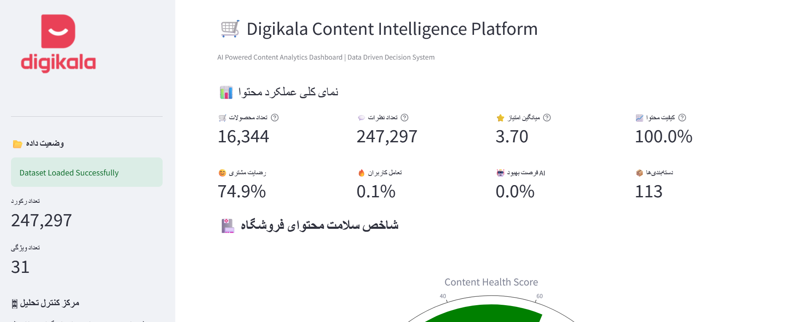

# 🛒 Digikala Content Analytics Platform

  

<h3 align="center">
AI-Powered Content Analytics & Optimization System
</h3>

A complete Data Science project for analyzing product content quality, customer feedback, sentiment, engagement metrics and generating intelligent content optimization insights.

---

# 📊 Dashboard Preview

  

---

# 🚀 Project Overview

In this project, a complete **Content Analytics Intelligence Platform** was developed using real-world e-commerce data.

The goal is to transform raw product information and customer reviews into actionable business insights.

The system analyzes:

- Product content quality
- Customer satisfaction
- Review sentiment
- Engagement behavior
- Content performance KPIs
- AI-based optimization opportunities

This project simulates an industrial analytics solution similar to what large e-commerce platforms use for improving digital content performance.

---

# 🎯 Business Problem

Large e-commerce platforms have millions of products and customer reviews.

Poor product content can lead to:

- Lower customer trust
- Reduced conversion rate
- Higher return rate
- Poor user experience

This platform answers important business questions:

✅ Which products need content improvement?

✅ Which categories have weak content quality?

✅ What are customers saying about products?

✅ Which factors influence customer satisfaction?

✅ How can AI optimize product descriptions?

---

# 🏗️ Project Architecture

